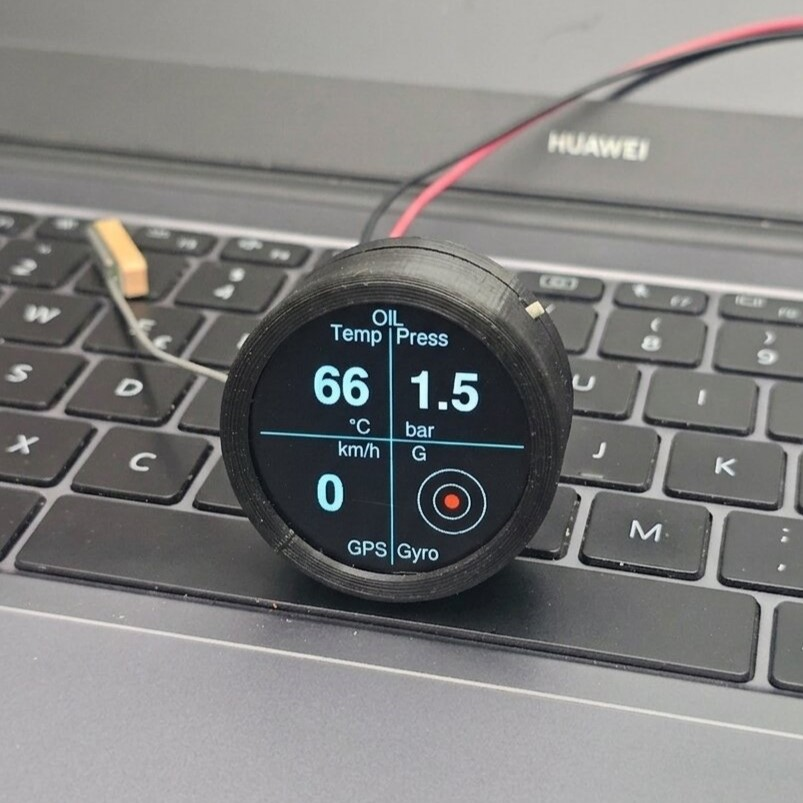
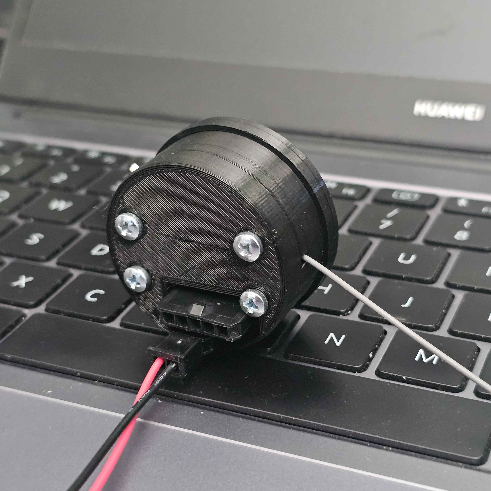
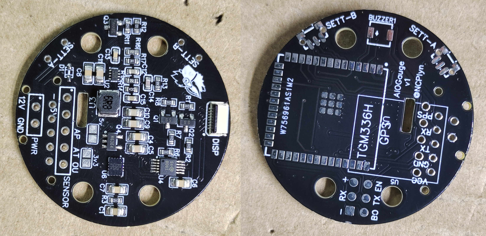
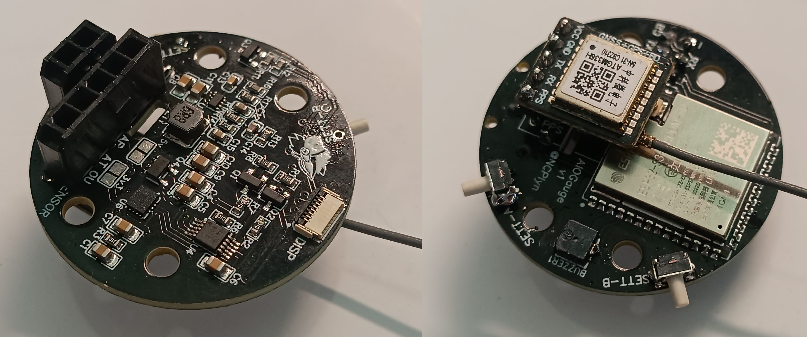

# AIOGauge

All-In-One-Oil-Gauge; a ESP32S3 project that uses:
- **PST-F 1** Bosch pressure and temperature [sensor](https://www.bosch-motorsport.com/content/downloads/Raceparts/en-GB/54249355.html) (0261230482 / 0261230341 / 0261230340 etc + 1928405159 connector)
- **LSM6DS3** accelerometer for G force realtime monitor
- **ATGM336H** GPS for realtime speed monitor + 0-100km/h / 0-60mph 10Hz timer
- **GC9A01** round TFT display shows all information
- **Logs** last 10 hours of measurements to view later at 2Hz
- **WiFi** to update the firmware, change settings, view logged graphs of values and have **live view** alongs side the display!
- Two buttons to edit setting on the device itself
- **STLs** for 3D printed enclosure in /enclosure, screwed together with M3x16

**Project in development**

## Photos

*Finished gauge in 3D printed enclosure*

  
*PCBWay provided & preassembled PCB*  

  
*Soldered rest of the components*  

## Sponsored by PCBWay

This project was made possible thanks to **[PCBWay](https://www.pcbway.com/)**, who kindly sponsored the **prototype PCBs** and handled the **SMD assembly**.

The PCBWay team discussed with me which parts would be sourced and used, and they were even able to assemble just a **single prototype board** - perfect for development. Before soldering, they sent me pictures of the component placement for confirmation, which gave me a lot of confidence in the build.  
  
The boards arrived quickly, the assembly quality was excellent, and I really appreciated the wide variety of PCB options available. 
If you’re looking for PCB prototyping or assembly, PCBWay offers quick turnaround, reliable manufacturing, and professional assembly services. 

